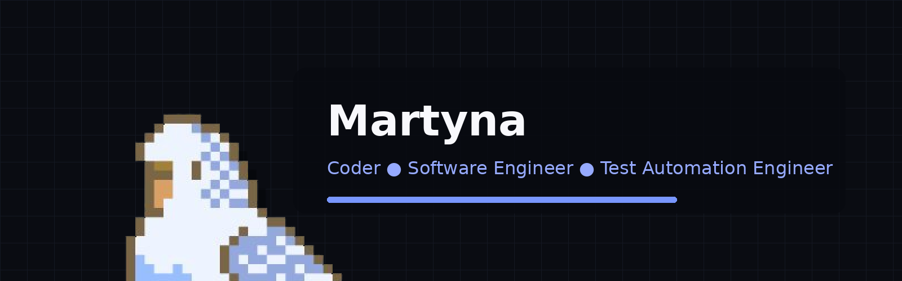

##### Software engineer | AI Engineer | Automation engineer | Test automation architect
###### 📩Contact: reeveecommission (at) gmail (dot) com
[](https://mwyrzykowska.dev)

<div align="left">
<details>
  <summary>About</summary>
  <p><sub>Full-time Lead Test Automation Engineer (enterprise environment) and independent Software and AI consultant.<br>
I help teams reduce regression risk, accelerate release cycles, and
build maintainable engineering ecosystems.
Based in Poland (CET/CEST), available for international
collaboration.   Experience with global banking, fintech, e‑commerce, and airline systems. Collaborated with big tech and startups. Prepared pocs, worked in scrum team, kanban team and alone.</sub></p>
</details>

---
<details>
  <summary>Freelance services</summary>
  
  ```
-   End-to-end test automation architecture
-   Backend & API validation
-   Framework design & implementation
-   Java & Python software development
-   no code/low code automation tools
-   AI-powered tooling & intelligent workflows
-   Reliability & security-focused testing (OWASP-aligned)
```


<sub>
Custom technical engagements available upon request.  
I work with project-based collaboration, hourly consulting and long-term technical partnership.  
</sub>
</details>

---

<details>
  <summary>Business information</summary>
  <p><sub>I operate as a registered business entity and issue VAT
invoices.  
All rates are net amounts.  
Please contact me by email to ask for custom pricing and volume packages pricing dependent on tech and amount of time needed. 
Polish clients: 23% VAT where applicable.
EU B2B: Reverse charge (VAT 0%).
EU private individuals: VAT may apply according to EU regulations.
Clients outside the European Union: VAT not applicable.</sub></p>
</details>


---
<details>
  <summary>How I work</summary>
  <p><sub>My values are fast onboarding, clear communication nd maintainable architecture with technical documentation and knowledge transfer.
I propose metrics and KPI to measure my work. Outcome-driven execution. Long-term scalability focus.  
Technically demanding challenge? Let's do it together.</sub></p>
</details>

---

###### Weekly development breakdown  

<!--START_SECTION:waka-->

```txt
Other             8 hrs 26 mins         █████████▓░░░░░░░░░░░░░░░   39.13 %
Markdown          4 hrs 55 mins         █████▓░░░░░░░░░░░░░░░░░░░   22.82 %
Java              2 hrs 45 mins         ███▒░░░░░░░░░░░░░░░░░░░░░   12.77 %
Java Properties   51 mins               █░░░░░░░░░░░░░░░░░░░░░░░░   03.96 %
JSON              43 mins               █░░░░░░░░░░░░░░░░░░░░░░░░   03.40 %
```

<!--END_SECTION:waka-->
